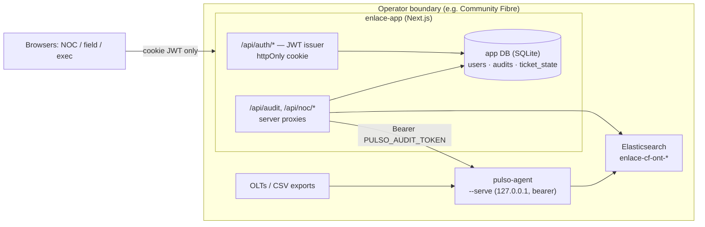
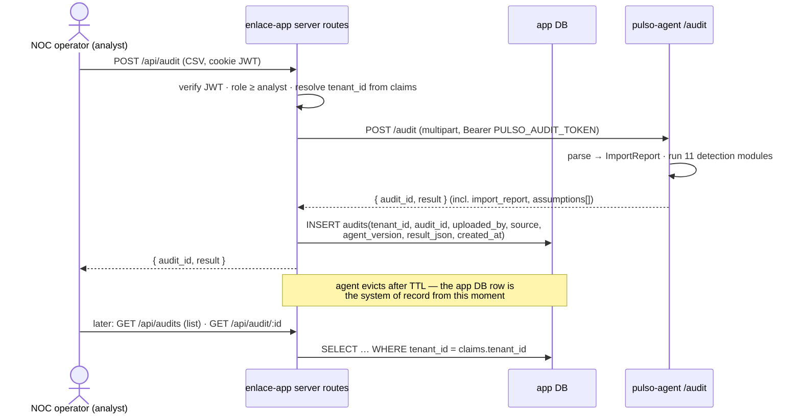

# Enlace Operations — Tenancy & User Profiles

Architecture for multi-tenancy and user accounts in enlace-app. Companion to
[ONTOLOGY.md](./ONTOLOGY.md); the honesty invariants there (§5) are treated
here as *architectural requirements* — they constrain storage and API shape,
not just rendering.

**TL;DR** — one operator = one tenant. Ship **single-tenant deploys** (one
app + one agent per operator, inside their boundary) but write **every table,
claim, and index with `tenant_id` from day one**, so the later Brazil SaaS is
a deployment change, not a rewrite. Auth: a **tiny in-house JWT issuer inside
the Next app** (httpOnly cookie, `jose`, SQLite users table), with claims
deliberately identical to the existing `python/api` JWTs so the issuer can be
swapped later without touching a single guard.

---

## 1. Tenancy model

### 1.1 The two shapes

**A tenant is an operator** (Community Fibre; later each Brazil ISP). Two
deployment shapes exist on the roadmap:

| | Shape 1: single-tenant deploy | Shape 2: shared app, tenant_id scoping |
|---|---|---|
| Who | CF pilot, any operator big enough to self-host | Long tail of Brazil ISPs (50–5,000 ONTs) |
| App | One enlace-app instance per operator | One instance, many tenants |
| Agent | Runs *inside* the operator's network, next to their OLTs | Per-tenant agents phoning home, or CSV-only upload |
| Data at rest | Never leaves the operator | Our Postgres/ES, isolated by `tenant_id` |
| Auth realm | Local users table, one tenant row | Central realm (`python/api` already has one) |
| Sales story | "Read-only by design, your data stays with you" (pilot proposal §Read-only) | Cheap onboarding, no ops burden on the ISP |

### 1.2 Recommendation: Shape 1 now, Shape-2-ready schema now

The CF pilot was *sold* on the self-hosted story — the proposal and pilot
plan promise read-only access and data that stays under the operator's
control. Shape 1 is not a stopgap; it's the product for operators of CF's
size, and it makes isolation trivial (the boundary is the VM, not a WHERE
clause).

But every persistence and auth decision below is written **tenant-scoped
anyway**:

- every JWT carries `tenant_id` (single-tenant deploys have exactly one,
  fixed at provision time — `TENANT_ID=community-fibre` in env);
- every app-DB table has a `tenant_id` column with a composite key;
- every Elastic index carries the tenant in its prefix;
- every server route resolves `tenant_id` from the *session*, never from a
  request parameter.

The migration to Shape 2 is then: point the app at Postgres instead of
SQLite, point auth at the central realm, run more than one tenant row.
No query changes, no claim changes, no view changes.

**Rule: code is always multi-tenant; deployment decides how many tenants a
process serves.** A single-tenant deploy is the degenerate case N=1, not a
different codebase.

### 1.3 What gets isolated, concretely

| Asset | Today | Single-tenant deploy | Shared-app future |
|---|---|---|---|
| **Audit uploads** | UUID-addressed, in-memory on the agent, 1 h TTL, 100-result cap (`serve.rs` ResultStore) | Persist the `AuditResult` JSON in the app DB keyed `(tenant_id, audit_id)` at upload time; the agent store becomes a hot cache, not the system of record | Same table in Postgres; agent per tenant or agent-less CSV path |
| **Elastic indices** | Agent writes `{index_prefix}-ont-{date}` (configurable) — but one stray hardcode `enlace-adtran-{date}` in `output/elastic.rs`, and the app hardcodes `enlace-ont-*` in `/api/noc/summary` | Prefix = `enlace-{tenant_id}`; app derives the search pattern from `TENANT_ID`, never a literal | Per-tenant ES API keys scoped to `enlace-{tenant_id}-*` index patterns — key-level isolation, no document-level security needed |
| **Tickets / ack state** | Derived from AuditResult; ack/close is session-local (lost on refresh) | `ticket_state` table `(tenant_id, ticket_id)` — ack, close-out, assignment, actor, timestamp | Same |
| **Auth realm** | localStorage persona picker | Users table in the app DB, one tenant | Central realm; `python/api` already stores tenants + users in Postgres with matching role vocabulary |
| **Agent credential** | `PULSO_AUDIT_TOKEN` env in the app | Same — one machine credential per deploy | Agent registry: `tenant_id → { agent_url, token }`, tokens per tenant |

Two credentials, never conflated:

- **User JWT** — authenticates a *person* to the app. Carries tenant + role.
- **`PULSO_AUDIT_TOKEN`** — authenticates the *app server* to the agent.
  Machine credential, injected server-side only, never in a browser, never
  in a JWT. (Already true today; keep it true.)

### 1.4 Single-tenant deployment diagram



Nothing crosses the operator boundary. Shape 2 moves the `operator boundary`
box into our cloud and multiplies the tenant rows; the arrows don't change.

---

## 2. User profiles & RBAC

### 2.1 Personas onto the role lattice

The lattice `viewer < analyst < manager < admin` (`src/lib/roles.ts`) stays.
**Role is the only thing authorization checks. Persona is a lens**: it picks
the home route and default framing, never grants capability. The founder's
five personas map cleanly onto what already exists:

| Founder's term | PersonaId | Role | Home |
|---|---|---|---|
| Emergency / field engineer | `field_engineer` | viewer | `/field` |
| NOC operator | `noc_operator` | analyst | `/noc` |
| Supervisor | `supervisor` | manager | `/supervisor` |
| Manager (network manager) | `network_manager` | manager | `/exec` |
| Exec (director) | `director` | admin | `/exec` |

### 2.2 Permission matrix

Views (routes declare `minRole`, as today — but enforced server-side too,
see §2.4):

| View | viewer | analyst | manager | admin |
|---|:-:|:-:|:-:|:-:|
| `/field` — my ticket queue, ticket detail | ✅ | ✅ | ✅ | ✅ |
| `/noc`, `/noc/onts` — incident board, ONT table | — | ✅ | ✅ | ✅ |
| `/supervisor` — cross-team queues, SLA | — | — | ✅ | ✅ |
| `/exec` — health score, capacity, churn, revenue-at-risk | — | — | ✅ | ✅ |
| `/admin` — users, tenant settings *(to build)* | — | — | — | ✅ |

Actions (each is a server route; the route checks the claim):

| Action | viewer | analyst | manager | admin |
|---|:-:|:-:|:-:|:-:|
| View faults / findings / import report | own tickets only | ✅ | ✅ | ✅ |
| Close out **own assigned** ticket (with evidence note) | ✅ | ✅ | ✅ | ✅ |
| Acknowledge incident | — | ✅ | ✅ | ✅ |
| Upload network data (CSV → audit) | — | ✅ | ✅ | ✅ |
| Ack/close **any** ticket, reassign, dispatch, re-prioritize | — | — | ✅ | ✅ |
| View revenue estimates + assumption sets | — | ✅ | ✅ | ✅ |
| Invite users, change roles, deactivate | — | — | — | ✅ |
| Tenant settings (ARPU assumptions, agent endpoint, ES prefix) | — | — | — | ✅ |
| Rotate agent token / billing (when it exists) | — | — | — | ✅ |

Notes:

- **Upload at analyst**, not manager: the NOC operator is exactly the person
  with the OLT export in hand; gating uploads at manager would kill the
  pilot's core loop.
- **ARPU / churn assumptions are tenant settings** (admin-editable) because
  they parameterize every `estimated_*` figure — which is also why they must
  be *stored per tenant* and echoed into results, per honesty invariant #1.
- Field engineer close-out is scoped to **assigned** tickets — ownership
  check in the route (`ticket_state.assignee == sub`), not a role rank.

### 2.3 JWT claims

```jsonc
{
  "sub": "u_7f3a…",              // user id (NOT persona id, unlike the stub)
  "name": "Priya N",
  "tenant_id": "community-fibre",
  "role": "analyst",              // the ONLY authorization input
  "persona": "noc_operator",      // lens: home route + default framing
  "iat": 1751500000,
  "exp": 1751543200,              // 12 h; refresh on activity
  "jti": "…"                      // revocation via a tiny denylist table
}
```

This is intentionally a superset-compatible shape with `python/api`'s tokens
(`python/api/auth/jwt_handler.py` issues `tenant_id` + `role` claims; its
`ROLE_HIERARCHY` is the identical `viewer/analyst/manager/admin` list). The
client `Session` type gains `tenantId` and keeps everything else.

### 2.4 Auth implementation: tiny in-house issuer in the Next app

**Recommendation: in-house JWT issuer as Next route handlers** — `jose` for
HS256 sign/verify, argon2id password hashes, users in the app DB, token in
an httpOnly `SameSite=Lax` cookie. Roughly four routes and one middleware:

```
POST /api/auth/login     { email, password } → Set-Cookie: enlace_jwt=…
POST /api/auth/logout    clears cookie, denylists jti
GET  /api/me             verified claims → Session for the client
POST /api/auth/invite    admin-only: creates user with role+persona, one-time link
src/middleware.ts        verifies cookie on /api/* and app routes; attaches claims
```

Why this over the alternatives:

- **vs Auth.js (NextAuth) credentials + JWT**: Auth.js earns its complexity
  when you need OAuth providers. A self-hosted ops app for an ISP's staff
  needs email+password and invites — none of Auth.js's provider machinery.
  Its encrypted session JWT is also app-internal by design; we want a plain
  verifiable JWT because *other services will verify it later* (shared-mode
  API, `python/api`). ~200 lines of `jose` code we fully understand beats a
  framework we'd fight.
- **vs adopting `python/api` as the issuer now**: it already exists and the
  claims match — tempting — but it drags Postgres plus a second service into
  every pilot deploy whose whole pitch is "one agent, one app, your network."
  Instead we **match its claim shape exactly**, so Shape 2 swaps the issuer
  (point `/api/me` verification at the shared `JWT_SECRET_KEY` / JWKS) with
  zero changes to guards or views.
- **When to revisit**: the moment an operator asks for SSO (CF on Entra ID
  is plausible), bolt OIDC on via `oauth4webapi` or switch to Auth.js *for
  that provider only* — the cookie/claims contract downstream doesn't move.

**Server-side enforcement is the actual point.** Today `RoleGuard` is
client-only — cosmetic. After this change: `middleware.ts` rejects
unauthenticated `/api/*`; each mutating route re-checks role (matrix §2.2)
and tenant; `RoleGuard` stays for UX (redirects, ACCESS DENIED panel) but is
no longer load-bearing. The existing `Session` shape was built to make this
"a transport change, not a data-model change" (auth.tsx TODO) — that bet
pays off here.

---

## 3. Upload-your-network flow, end to end

### 3.1 Sequence



Changes from today:

1. **Persist on upload.** The agent's ResultStore (1 h TTL, in-memory) stays
   as a cache; the app writes the result to its own DB the moment the upload
   succeeds. Fixes the current failure mode where a refresh after an hour
   loses the audit, and replaces the `localStorage["enlace.last_audit_id"]`
   hack in `LiveAdapter` with a real tenant-scoped `GET /api/audits` list
   ("latest audit" = newest row for your tenant, visible to every colleague,
   not just the uploader's browser).
2. **Provenance is a stored record, not a UI guess.** Each audit row stores
   `source` (`csv-upload` | `live-agent` | `demo`), `uploaded_by`,
   `agent_version`, and the original filename. The `SourceBadge` renders
   *this row*, so provenance survives refreshes, colleagues, and Shape 2.
3. **Later, live feed:** when the agent streams to ES continuously, the same
   flow applies with `source: live-agent` — `/api/noc/summary` queries
   `enlace-{tenant_id}-ont-*` (derived from claims, not the current
   hardcoded `enlace-ont-*`), and scheduled audits land in the same
   `audits` table.

### 3.2 One audit, five projections

The same persisted `AuditResult` row, filtered per persona — projection
happens in server routes (so viewer never receives fleet data it can't see):

| Persona | Projection of the audit |
|---|---|
| NOC operator | `onts[]` table, `faults[]`, `diagnostics.alerts[]`, per-port drill-down; ack actions write `ticket_state` |
| Field engineer | `tickets[]` filtered to `assignee == sub`, each with `evidence[]`, `recommended_action`, geo *if joined* — else "no location data" |
| Supervisor | `tickets[]` grouped by `team`, SLA due dates (`generated_at + sla_days`), breach flags, reassignment actions |
| Network manager | `capacity[]` (`months_to_full` hotspots), `sfp_health[]` trends, `churn_risk[]` cohort — planning lens |
| Director | `summary.health_score`, online/offline/**unknown** triple, `impact`, revenue-at-risk **with estimate badge** |

### 3.3 Honesty invariants as architectural requirements

These are load-bearing constraints on the tenancy layer, not styling:

1. **No projection may strip `assumptions[]` from `estimated_*` fields.**
   Server-side persona filtering trims *rows* (viewer sees only assigned
   tickets), never *evidence or assumption fields* within a row. Rule of
   thumb: filters subset arrays; they never map objects.
2. **`import_report` travels with the audit forever.** It is a column-level
   part of the persisted result; every route that returns an audit returns
   it; every view renders the banner. An audit without its import report is
   an integrity error, not a display option.
3. **`Unknown` reconciliation survives storage.** `total = online + offline
   + unknown` holds in the persisted row because we store the agent's JSON
   verbatim (no re-aggregation in the app layer — the app *reads*, the agent
   *computes*).
4. **Provenance from the DB row** (§3.1.2): live/audit/demo/source-file is
   recorded at write time. If ES is unreachable the NOC view says so with
   the stored fallback — never fakes liveness (`/api/noc/summary` contract
   already does this; keep it).
5. **Missing is missing across tenants too.** A tenant with no geo join gets
   "no location data"; a tenant that never measured uptime gets "not
   measured". Tenant settings never default these to zeros.

---

## 4. Module map

Honest inventory. "Stub" means it demos but doesn't hold weight.

| # | Module | Today | To build | Size | Build order |
|---|---|---|---|---|---|
| 1 | Role lattice + personas (`roles.ts`) | ✅ done, matches `python/api` | add `tenantId` to `Session` | S | with #2 |
| 2 | **Auth: JWT issuer + middleware** | ❌ localStorage persona picker (stub) | §2.4: login/logout/me/invite routes, `jose`, argon2id, httpOnly cookie, `middleware.ts` server enforcement | **M** | **1** |
| 3 | **App DB** (SQLite + drizzle; Postgres-ready schema) | ❌ none | `users`, `audits`, `ticket_state`, `jwt_denylist`, `tenant_settings` — all keyed by `tenant_id` | **M** | **2** |
| 4 | **Audit persistence + listing** | ❌ agent TTL store + localStorage id (stub) | persist on upload; `GET /api/audits`; retire `enlace.last_audit_id` | S–M | **3** |
| 5 | **Ticket state** (ack/close/assign) | ❌ session-local only (stub) | `ticket_state` writes with actor + timestamp; ownership check for viewer close-out; supervisor reassignment | M | **4** |
| 6 | Server-side persona projections | partial (views filter client-side) | move viewer/analyst filtering into routes per §3.2 | S | 5 |
| 7 | Admin view: users + tenant settings | ❌ none | `/admin` (minRole admin): invite, role change, deactivate; ARPU/agent-endpoint/ES-prefix settings | M | 6 |
| 8 | Elastic tenant scoping | ❌ `enlace-ont-*` hardcoded in app; stray `enlace-adtran-{date}` hardcode in agent | derive pattern from `TENANT_ID`; fix agent hardcode to honor `index_prefix` | S | 7 |
| 9 | Server proxies (`/api/audit*`, `/api/noc/summary`) | ✅ done, secrets server-side | add auth middleware (comes free with #2) | S | with #2 |
| 10 | Views `/`, `/noc*`, `/field*`, `/supervisor`, `/exec` | ✅ done, honesty invariants rendered | swap `useAuth` to `/api/me`; no layout changes | S | with #2 |
| 11 | Geo join (customer records → `EnrichedTicket`) | ❌ honest empty state ("no location data"); maplibre installed, unused | CSV upload of ISP customer records, serial→address join, map pins | **L** | 8 (post-pilot ok — the empty state is honest) |
| 12 | Shape-2 control plane (Postgres, tenant provisioning, agent registry, central realm swap) | ❌ (`python/api` realm exists but unwired) | only when Brazil SaaS starts; schema is ready by construction | **L** | 9 (deferred) |
| 13 | SSO / OIDC | ❌ | on operator demand only | M | deferred |

**Critical path for a credible multi-user pilot: #2 → #3 → #4 → #5.** After
those four, two CF staff can log in with real accounts, upload a network
export, and see the same audit with acks that survive a refresh — the whole
pilot loop, tenant-scoped from birth.

Explicitly out of scope for now: billing (no pricing in the pilot — per the
CF pilot posture, don't build billing tables yet; `tenant_settings.plan`
exists as a string and nothing reads it), rate limiting per plan (Shape 2
concern; `python/api` already has the plan→rate-limit map when needed), and
document-level ES security (per-tenant API keys are enough).
